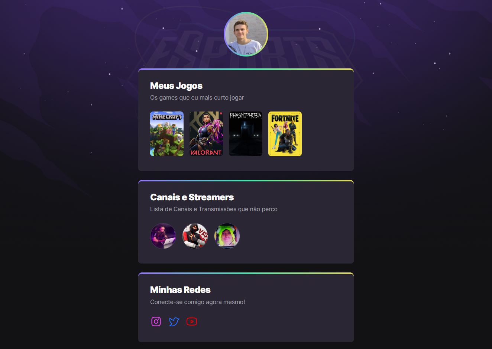

# NLW eSports

>Trilha Explorer 

Projeto construído durante o evento Next Level Week da Rocketseat.

[🔗Clique aqui para acessar](https://victorhugomarinocaproni.github.io/nlw-esports-explorer)

## 🛠 Tecnologias

- HTML
- CSS
- Git e Github

## ✉ Contato

-  victorcaproni04@gmail.com

## 🆕 O que aprendi:

- Primeiro contato com programação WEB que tive, aprendendo sobre o funcionamento do HTLM e do CSS, bem como utilizar o Git e o Github.

- Primeira vez utilizando recursos de animação no CSS, o que achei extremamente interessante pois enriquece o projeto. 